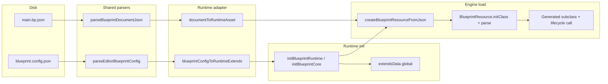

# Agent / contributor notes — Blueprint editor vs runtime

This file summarizes the two primary JSON artifacts, where their contracts live, and how data flows from disk to the execution engine. Keep it aligned with `src/shared/JsonType/*.ts` when changing shapes.

## Two primary config files

| Artifact | Role |
|----------|------|
| **`blueprint.config.json`** (default name; override with VS Code setting `blueprint.nodeDefFile`) | **Project manifest**: node palette (`nodeDefs`), base classes and lifecycle hooks (`baseClasses` as a **record**), global event channels (`globalEventChannels`), runtime template ids (`runtimeTemplates`). The editor uses it for Add Node, Event.Start pins, global event nodes, and validation. |
| **`*.bp.json`** (e.g. `main.bp.json`) | **Single blueprint document**: main `graph` (`nodes`, `edges`, `variables`), optional `functions` / `dispatchers`, `inherits` (must match a key in `baseClasses`), `metadata`, etc. |

### Contract sources (TypeScript)

- **Config JSON**: `src/shared/JsonType/BlueprintConfigType.ts` — `BlueprintConfigRootJson` / `BlueprintConfigFileJson` (four top-level keys required; pins as `"name:type"` strings or `{ name, type }`).
- **Editor document**: `src/shared/JsonType/BlueprintJsonTypes.ts` (overview) + **`src/shared/blueprint/documentModel.ts`** (canonical types, `parseBlueprintDocumentJson`, normalization, legacy `graphs[]`).

**Runtime asset** (`BlueprintAssetJson`: `extends`, `blueprintArr`, …) is **not** the same on-disk shape as editor `.bp.json`. See comments in `BlueprintJsonTypes.ts` and `plan/editor-with-runtime.md`.

## Who generates `blueprint.config.json`?

**`src/runtime/` does not write `blueprint.config.json` for the editor** — the engine only consumes parsed config. The VS Code extension **reads** the file from the workspace (`src/host/treeEditorProvider.ts` — `resolveBlueprintConfigUri`, `parseEditorBlueprintConfig`) and sends parsed config to the webview.

For the **repo sample** workspace, the file is maintained from **`examples/web-runtime/blueprintConfig/manifest.ts`** (decorators + registration) via **`npm run export:blueprint-config`** → `sample/blueprint.config.json`. See `examples/web-runtime/README.md`. Other products may author JSON by hand, host tooling, or an external CLI — not `src/runtime/core/`.

## End-to-end: config + `.bp.json` → run

Same sequence as `examples/web-runtime/main.ts` (`runFromEditorFiles`):

1. **Config → `extendsData`**: `src/runtime/adapter/blueprintConfigToRuntimeExtends.ts` maps `EditorBlueprintConfig` to per–base-class `events[]`. `initBlueprintRuntime` → `initBlueprintCore` merges the **passed object’s keys** into global `extendsData` (in demos the object is already the extends shape, not the raw config root).

2. **`.bp.json` → `BlueprintAssetJson`**: `src/runtime/adapter/documentToRuntimeAsset.ts` converts a normalized `BlueprintDocument` into a **minimal** runtime asset (MVP: linear exec chain; templates `Event.Start` + `Debug.Print` only — see file header and `documentToRuntimeAsset.test.ts`).

3. **Asset → class**: `src/runtime/core/BlueprintLoader.ts` — `createBlueprintResourceFromJson` → `BlueprintResource.initClass` / `parse()` → `bp.cls`; host instantiates and calls lifecycle methods.

## Checklist when changing contracts

- **Config shape**: Update `BlueprintConfigType.ts` + `parseEditorBlueprintConfig.ts`, then re-check `blueprintConfigToRuntimeExtends.ts`.
- **Document shape**: Treat `documentModel.ts` as source of truth; sync `BlueprintJsonTypes.ts` comments, host validation under `src/host/build/`, and any `documentToRuntimeAsset` assumptions.
- **Smoke the bridge**: Run `npm run test:build-validation` and `examples/web-runtime` (`npm run dev:web-runtime`).

## Related plans

- Layering: `plan/editor-with-runtime.md`
- Resume / QA: `plan/dev-handoff.md`, `.cursor/skills/blueprint-dev-resume/SKILL.md`
